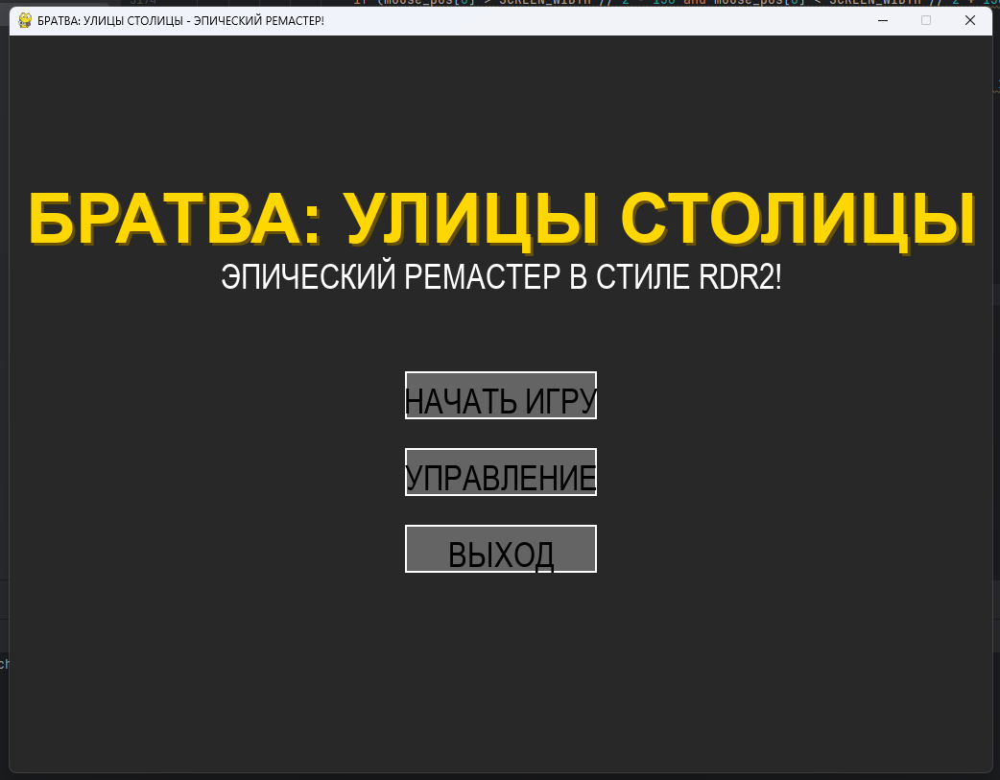
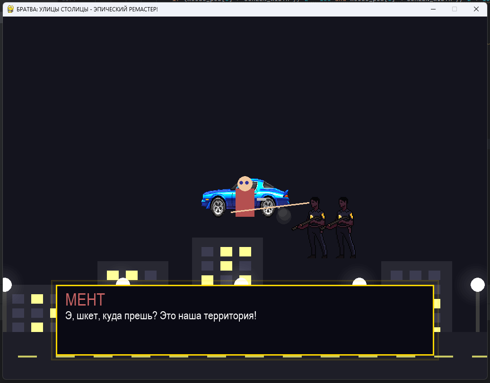
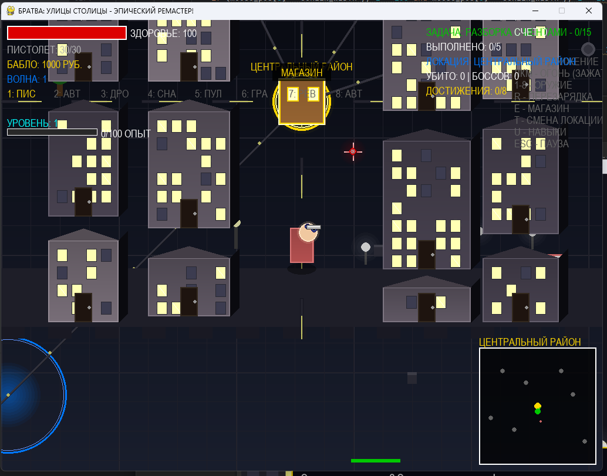
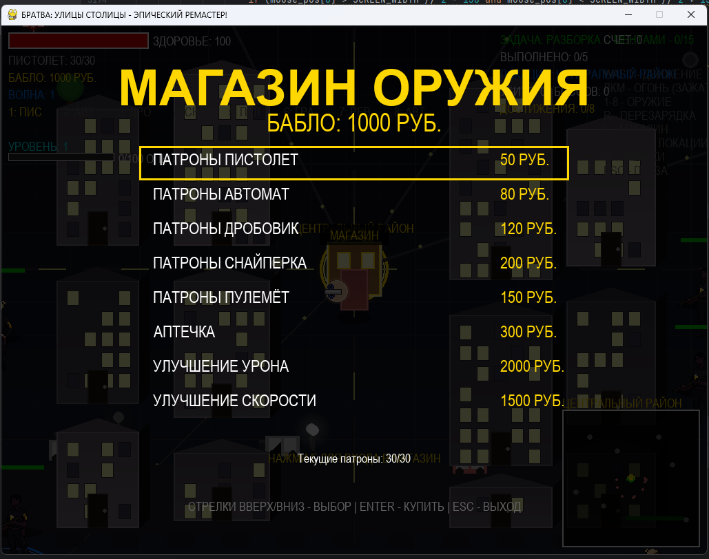

<div align="center">

# 🔥 БРАТВА: УЛИЦЫ СТОЛИЦЫ 🔥


**ЭПИЧНЫЙ РЕМАСТЕР В СТИЛЕ HOTLINE MIAMI С ВАЙБОМ РУССКОГО ПАЦАНА!**

<br>

[](https://www.python.org/)
[](https://www.pygame.org/)
[](LICENSE)
[](LICENSE)
[](LICENSE)

<br>

**⚡ ТЫ ГОТОВ СТАТЬ КОРОЛЁМ РАЙОНА? ⚡**

<br>

---

</div>

## 🎯 ЧТО ЭТО ЗА ХУЙНЯ?

<div align="center">

**БРАТВА: УЛИЦЫ СТОЛИЦЫ** - это не просто игра, это образ жизни! Топ-даун шутер где ты - настоящий пацан, который прошел зону и вернулся чтобы навести порядок в своем районе.

</div>

> ⚠️ **ВНИМАНИЕ:** Проект создан для настоящих пацанов! Хуйня и понты не пройдут!

### 🚨 ЧЕМ ЗАЕБЁШЬСЯ:

<table>
<tr>
<td width="50%">

- 💥 **ПИЗДАТАЯ СТРЕЛЬБА**  
  `8 видов оружия с уникальной физикой`

- 🏙️ **ЖИВОЙ ГОРОД**  
  `Генерируемые здания, дороги, атмосфера`

- 👮 **НАСТОЯЩИЕ ВРАГИ**  
  `Менты, быдло, крысы - каждый со своим AI`

</td>
<td width="50%">

- 🎬 **ЭПИЧНЫЕ КАТСЦЕНЫ**  
  `Как в RDR2, только по-нашему!`

- 💰 **СИСТЕМА БАБЛА**  
  `Зарабатывай, трать, становись круче`

- 🏆 **МНОГО МИССИЙ**  
  `От разборок с ментами до уличных войн`

- 🔥 **ФИЗИКА НА УРОВНЕ**  
  `Пули летят как надо, враги падают красиво`

</td>
</tr>
</table>

---

## 🖼️ КАК ЭТО ВЫГЛЯДИТ

<div align="center">

### 🎮 ГЕЙМПЛЕЙ - ЧИСТАЯ ДРАКА

<table>
<tr>
<td width="50%" align="center">

**🎯 ГЛАВНОЕ МЕНЮ**



_Выбирай миссию и начинай отжиг!_

</td>
<td width="50%" align="center">

**💥 БОЕВАЯ СИСТЕМА**



_Пали по всем мудакам!_

</td>
</tr>
<tr>
<td width="50%" align="center">

**🏙️ ОТКРЫТЫЙ МИР**



_Исследуй город и наводи порядок!_

</td>
<td width="50%" align="center">

**🛒 МАГАЗИН**



_Покупай оружие и улучшения!_

</td>
</tr>
</table>

</div>

---

## 🚀 КАК ЗАПУСТИТЬ ЭТУ ХУЙНЮ

### 📋 ЧТО НАДО:

<div align="center">

| Требование | Версия | Статус |
|:----------:|:------:|:------:|
| 🐍 **Python** | 3.8+ | ✅ Обязательно |
| 🎮 **Pygame** | 2.0+ | ✅ Обязательно |
| 💪 **Желание** | ∞ | ✅ Желательно |

</div>

### 🛠️ ШАГИ (ДЛЯ ЧАЙНИКОВ):

<details>
<summary><b>📥 ШАГ 1: КАЧАЕМ ХУЙНЮ</b></summary>

```bash
# Если ты не лох
git clone https://github.com/canick338/BydlogameVibe.git
cd BydlogameVibe
```

</details>

<details>
<summary><b>📦 ШАГ 2: СТАВИМ ДЕПЕНДЕНСИ</b></summary>

```bash
# Один раз и нахуй
pip install pygame
```

</details>

<details>
<summary><b>▶️ ШАГ 3: ЗАПУСКАЕМ БРАТКУ</b></summary>

```bash
# И поехали!
python main.py
```

</details>

> 💡 **СОВЕТ БРАТАН:** Если не работает - проверь пути к файлам и не будь дауном!

---

## 🎮 УПРАВЛЕНИЕ (ЗАПОМНИ, ЧТОБЫ НЕ ПРОЕБАТЬ)

<div align="center">

| 🎯 ДЕЙСТВИЕ | ⌨️ КЛАВИША | 📝 ЧТО ДЕЛАЕТ |
|:-----------:|:---------:|:------------:|
| **🏃 ДВИЖЕНИЕ** | `W A S D` | Бегаешь как угорелый |
| **🔫 СТРЕЛЬБА** | `ЛКМ` | Палишь по всем мудакам |
| **🎯 ПРИЦЕЛ** | `КУРСОР` | Целишься куда надо |
| **🔪 ОРУЖИЕ** | `1-8` | Меняешь стволы (8 видов!) |
| **🔄 ПЕРЕЗАРЯДКА** | `R` | Чтоб не остаться с голым хуем |
| **⏸️ ПАУЗА** | `ESC` | Отдохнуть, покурить |
| **⏭️ ПРОПУСК** | `ПРОБЕЛ` | Когда не до разговоров |

</div>

---

## 🎯 ЧЕМ ЗАНИМАТЬСЯ В ИГРЕ

### 🎪 ОСНОВНЫЕ МИССИИ:

<div align="center">

<table>
<tr>
<td width="33%" align="center">

### 🚔 РАЗБОРКА С МЕНТАМИ

_"Менты зажрались - убери 15 штук, покажи кто тут хозяин"_

</td>
<td width="33%" align="center">

### 💰 СБОР ДАНИ

_"Бизнесмены платят мало - собери 5к рублей, напомни кто босс"_

</td>
<td width="33%" align="center">

### ⚔️ УЛИЧНАЯ ВОЙНА

_"Новая банда пришла - продержись 2 минуты, стань легендой"_

</td>
</tr>
</table>

</div>

### 🏆 ЧТО ПРОКАЧИВАТЬ:

<div align="center">

| 💪 ЗДОРОВЬЕ | 🎯 СТРЕЛЬБА | 💰 БАБКИ | 📈 РЕПУТАЦИЯ |
|:-----------:|:-----------:|:--------:|:-----------:|
| Чтоб дольше жить | Чтоб точнее палить | Чтоб больше тратить | Чтоб боялись |

</div>

---

## 🏙️ ЛОКАЦИИ ГДЕ ОТЖИГАЕМ

<div align="center">

| 🗺️ ЛОКАЦИЯ | 🎨 ВАЙБ | 👥 КТО ВСТРЕТИТ |
|:----------:|:-------:|:--------------:|
| **🎪 ЦЕНТР** | Богатый район | Менты, бизнесмены |
| **🏭 ПРОМЗОНА** | Заброшенные заводы | Быдло, крысы |
| **🏘️ СТАРЫЙ ГОРОД** | Узкие улочки | Все кто попал |
| **⚓ ПОРТ** | Доки и причалы | Контрабандисты |

</div>

---

## 🔧 ТЕХНИЧЕСКИЕ ПИЗДЕЦЫ

### 🛠️ ЧТО ВНУТРИ:

<div align="center">

<table>
<tr>
<td width="50%" align="center">

**🎮 Pygame**  
`Движок (старый но надежный)`

**🐍 Python**  
`Язык (простой как три копейки)`

</td>
<td width="50%" align="center">

**⚙️ Физика**  
`Своя, пиздатая`

**🤖 AI врагов**  
`Умные как менты в ДПС`

</td>
</tr>
</table>

</div>

### 📁 СТРУКТУРА (ДЛЯ ГИКОВ):

```
bydlogame/
├── main.py              # Главный файл - тут магия
├── player.py            # Твой персонаж - пацан
├── enemy.py             # Враги - мудаки
├── weapon.py            # Стволы - почухать
├── city.py              # Город - где всё происходит
├── mission.py           # Миссии - что делать
├── cutscene.py          # Катсцены - для вайба
└── assets/              # Картинки, музыка
```

---

## 🎵 МУЗЫКА ДЛЯ АТМОСФЕРЫ

<div align="center">

### 🎼 ВЕЛИКИЙ КОМПОЗИТОР ЭТОЙ ХУЙНИ

**🎹 Shramov** - великий композитор этой хуйни! Его саундтрек `music/musicingame.ogg` создаёт неповторимую атмосферу пацанского отжига!

<table>
<tr>
<td width="50%" align="center">

**🎵 Саундтрек**  
`music/musicingame.ogg`

**🎧 Стиль**  
`Пацанский вайб`

</td>
<td width="50%" align="center">

**👨‍🎨 Композитор**  
`Shramov`

**🔥 Вайб**  
`100%`

</td>
</tr>
</table>

> 💡 **СОВЕТ:** Если нет файла - играй без музыки, как настоящий пацан! Или включи русского рэпа на фоне для полного погружения.

</div>

---

## 🐛 ЕСЛИ ЧТО-ТО ПОШЛО НЕ ТАК

### ❌ ЧАСТЫЕ ПРОБЛЕМЫ:

<div align="center">

<table>
<tr>
<td width="50%">

- ❌ **Не запускается**  
  `Проверь Python и Pygame, школота`

- ❌ **Нет музыки**  
  `Найди файл или играй без неё`

</td>
<td width="50%">

- ⚠️ **Враги тупые**  
  `Это фича, а не баг`

- ⚠️ **Мало вайба**  
  `Добавь своего`

</td>
</tr>
</table>

</div>

### 🆘 ЕСЛИ ВСЁ ПЛОХО:

<div align="center">

1. 🔄 Перезапусти игру
2. ✅ Проверь файлы
3. 💪 Не ной - разберись
4. 👥 Спроси у братанов

</div>

---

## 🔮 ЧТО БУДЕТ ДАЛЬШЕ

<div align="center">

- [ ] **🔫 БОЛЬШЕ ОРУЖИЯ** - чтоб было из чего выбрать
- [ ] **🗺️ НОВЫЕ ЛОКАЦИИ** - чтоб было где похавать
- [ ] **👥 МУЛЬТИПЛЕЕР** - чтоб с братанами играть
- [ ] **👑 БОССЫ** - чтоб было кого мочить
- [ ] **🚗 ТРАНСПОРТ** - чтоб быстрее перемещаться

</div>

---

## 📜 ЛИЦЕНЗИЯ (ШУТКА)

<div align="center">

```
╔════════════════════════════════════════╗
║  Copyright (c) 2024 Наши пацаны       ║
╠════════════════════════════════════════╣
║  ✅ Разрешается:                       ║
║     • Играть на здоровье               ║
║     • Модить для себя                 ║
║     • Хвастаться перед друзьями        ║
╠════════════════════════════════════════╣
║  ❌ Запрещается:                       ║
║     • Быть быдлом                      ║
║     • Жаловаться на баги               ║
║     • Играть без вайба                 ║
╚════════════════════════════════════════╝
```

</div>

---

## 👨‍💻 АВТОРЫ И КОМАНДА

<div align="center">

<table>
<tr>
<td width="50%" align="center">

**🎮 Разработка**  
`Сделано с ❤️ и ⚡`

**💻 Код**  
`Пацанский стиль`

</td>
<td width="50%" align="center">

**🎹 Музыка**  
`Shramov`

**🔥 Вайб**  
`100%`

</td>
</tr>
</table>

<br>

**Сделано с ❤️ и ⚡ для настоящих пацанов!**

> 💪 *"В жизни как в игре - главное вайб и братва!"*

</div>

---

## 🙏 БЛАГОДАРНОСТИ

<div align="center">

<table>
<tr>
<td width="20%" align="center">

**👮 Менты**  
`За вдохновение`

</td>
<td width="20%" align="center">

**🏙️ Город**  
`За атмосферу`

</td>
<td width="20%" align="center">

**👥 Братва**  
`За поддержку`

</td>
<td width="20%" align="center">

**🐍 Python**  
`За возможность`

</td>
<td width="20%" align="center">

**🎹 Shramov**  
`За музыку`

</td>
</tr>
</table>

<br>

### 💻 ПРИ ПОДДЕРЖКЕ РАЗРАБОТЧИКА

<div align="center">

<table>
<tr>
<td width="100%" align="center">

**🚀 Разработано при поддержке разработчика**

**[@hoprik](https://github.com/hoprik/)**

[](https://github.com/hoprik/)
[](https://github.com/hoprik/)

</td>
</tr>
</table>

</div>

</div>

---

<div align="center">

## ⚡ ВАЖНОЕ ПРЕДУПРЕЖДЕНИЕ ⚡

**ЭТО ИГРА! НЕ ПОВТОРЯЙ ЭТОГО В РЕАЛЬНОЙ ЖИЗНИ!**

**СДЕЛАНО С ДУШОЙ ДЛЯ ТЕХ, КТО ПОНИМАЕТ**

<br>

[](LICENSE)
[](LICENSE)
[](https://www.python.org/)
[](https://www.pygame.org/)

<br>

**⭐ Если понравилось - поставь звезду! ⭐**

<br>

---

<div align="center">

### 🎮 СТАТИСТИКА ПРОЕКТА


</div>

</div>
